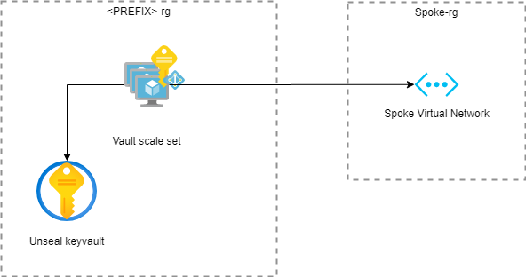

# infrastructure.azure.core.secrets

The `infrastructure.azure.core.secrets` repository stores the resource configuration files for
[Terraform](https://www.terraform.io/) to deploy a
[resource group](https://docs.microsoft.com/en-us/azure/azure-resource-manager/management/overview#terminology) containing a [Vault](https://vaultproject.io) cluster to an Azure subscription. The
resources created by the configuration in this repository are expected to be connected to a
[Spoke network](https://github.com/Calvinverse/infrastructure.azure.network.spoke).

The Terraform configuration creates the following group of resources:

* One resource group to contain all the resources.
* An AzureAD group that allows managed identities attached to the VMs inside the spoke network to [read Vault unseal secrets](https://www.vaultproject.io/docs/configuration/seal/azurekeyvault).
* A [key vault](https://docs.microsoft.com/en-us/azure/key-vault/general/overview)
  for the infrastructure.
* A [virtual machine scale set](https://docs.microsoft.com/en-us/azure/virtual-machine-scale-sets/overview) that will run the [Vault nodes](https://github.com/Calvinverse/resource.secrets). The virtual machines in the scale set have a managed identity. The managed identity is added to the Azure AD group for Consul server discovery.
  * A set of [network interface](https://docs.microsoft.com/en-us/azure/virtual-network/virtual-network-network-interface) instances for the Consul server virtual machines.
  * The association between the network interface and the Network Security Group (NSG) of the Spoke network.

During the creation of the Vault resources several connections are made to the Spoke
network, and a log analytics workspace. These resources are found by names, where these names are currently encoded in the Terraform `main.tf` file.

Most resources are named after the type of resource they are, e.g. `-rg` for the resource group, prefixed with a standard prefix. The prefix consists of a combination of the Environment, e.g. Production, the Azure location,
e.g. Australia East, a category, in this case `cv-core-secrets`, and the spoke ID:

    ${var.environment_short}-${var.location_short}-tf-${var.category}-${var.spoke_id}

The default values for each of the variables are defined in the `variables.tf` file

* `environment_short` = `t` - For test
* `location_short` = `aue` - For the Australia East region
* `category` = `cv-core-secrets`
* `spoke_id` = `01`

Which leads to a prefix of: `p-aue-tf-cv-core-secrets-01`

By default the following tags are added:

* **category** - Set to the category. Defaults to `cv-core-secrets`
* **environment** - Set to the environment. Defaults to `test`
* **image_version** - Set to the version of the image containing the Consul server instance.
* **location** - The Azure region in which the resources are created. Defaults to `australiaeast`
* **source** - The commit ID of the current commit
* **version** - The version of the resources

Additional tags can be added by setting the `tags` variable as defined in the `variables.tf` file.

## Variables

* **admin_password** - The password of the administrator user for the machines.
* **cluster_size** - The size of the cluster. Defaults to 3.
* **resource_version** - The version of the [Vault image](https://github.com/Calvinverse/resource.secrets). It is expected that this image is stored in a resource group as an Azure image. Currently the name of this resource group is encoded in the `main.tf` configuration file.
* **category** - The name of the category that all the resources are running in. Defaults to `cv-core-secrets`.
* **consul_cert_path** - The path to the directory in which the consul certificates are placed.
* **datacenter** - The name of the environment that all the resources are running in. Used as the name of the Consul data center. Defaults to `calvinverse`.
* **domain** - The name of the DNS domain that all the resources are running in. Used to resolve the static resources, e.g. Consul servers. Defaults to `consulverse`.
* **domain_consul** - The name of the Consul DNS domain that all the resources are running in. Used as the domain of the Consul data center. Defaults to `consulverse`
* **encrypt_consul** - The Consul encrypt key.
* **environment** - The name of the environment that all the resources are running in. Defaults to `test`
* **spoke_id** - The ID of the spoke. Used to uniquely identify different spoke environments. Defaults to `01`.
* **location** - The full name of the Azure region in which the resources should be created. Defaults to
  `australiaeast`.
* **meta_source** - The commit ID of the current commit from which the plan is being created. Used to tag the resources.
* **meta_version** - The version of the infrastructure as it is being generated. Used to tag the resources.
* **spoke_id** - The ID of the spoke into which the consul server cluster should be placed. Defaults to `01`.
* **subscription_production** - The subscription ID of the production subscription. Used to find the log analytics resources.
* **subscription_test** - The subscription ID of the test subscription.
* **tags** - Tags to apply to all resources created.

## Use

In order to run the Terraform configuration in this repository you need to have an Azure subscription and be [connected to that subscription](https://www.terraform.io/docs/providers/azurerm/index.html).

Once you are signed in run the Terraform [plan](https://www.terraform.io/docs/commands/plan.html) command to preview the changes that will be made.

    tf plan -var subscription_production=<SUBSCRIPTION_ID> -var subscription_test=<SUBSCRIPTION_ID> -var meta_source=<GIT_COMMIT_HASH> -var meta_version=<VERSION> -var consul_cert_path=<LOCAL_MACHINE_PATH_TO_CERT_DIR> -var encrypt_consul=<CONSUL_ENCRYPT_KEY> -out ./build/tf/plan

When you are happy with the plan execute the plan with the Terraform [apply](https://www.terraform.io/docs/commands/apply.html) command.

    tf apply ./build/tf/plan

